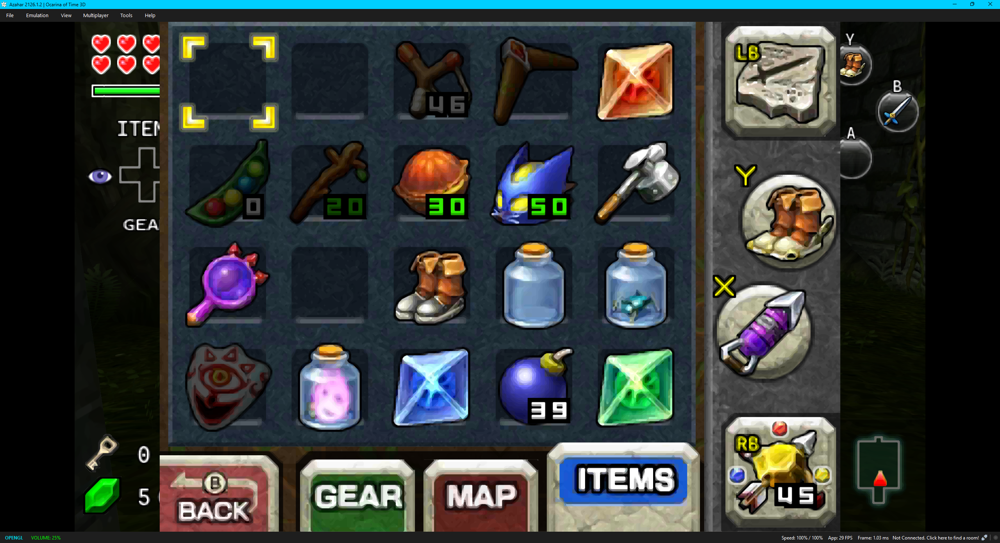
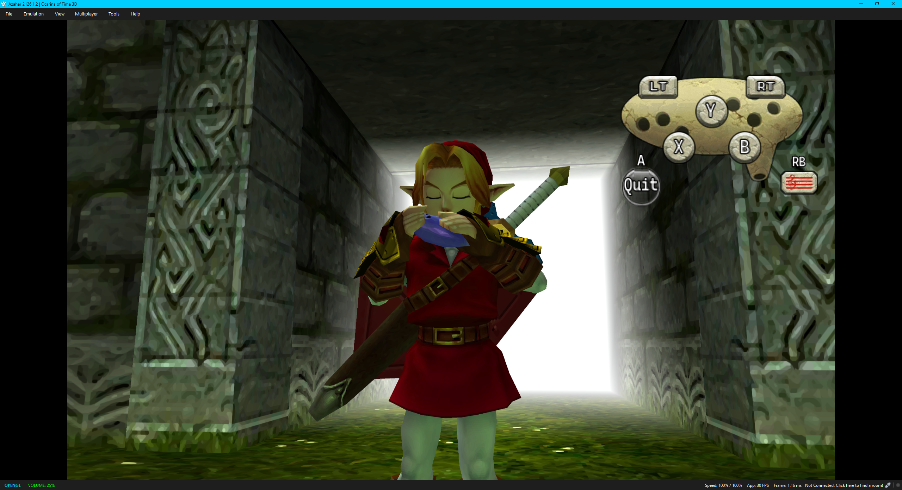
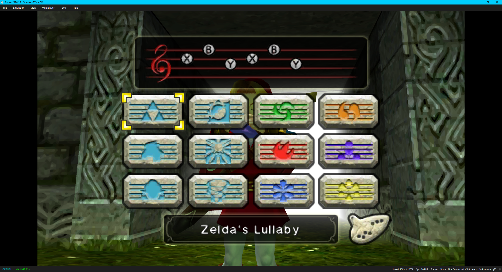

# The One Screen

**The One Screen** is a comprehensive single-screen conversion for *The Legend of Zelda: Ocarina of Time 3D*, designed to make the game feel natural on a traditional controller and modern emulator setup.

Rather than simply rearranging the two 3DS displays, the mod modifies the game's UI, controls, HUD behavior, menus, Ocarina interface, and screen-routing logic so that touchscreen-dependent features can be comfortably used without constantly interacting with a second display.

The goal is to preserve the look and feel of *Ocarina of Time 3D* while making it behave more like a native single-screen console game.

## Features

- Single-screen-friendly gameplay and menu presentation
- Redesigned HUD for traditional controllers
- Xbox-style button labels and contextual controls
- Proper LB/RB item functionality and correct X/Y item-slot behavior
- Reworked Ocarina controls and presentation, including RB above the music-sheet icon
- D-pad shortcuts for Items, Gear, Ocarina, and View
- Start opens the Pause/System menu; Select opens the Map
- Inventory, Gear, Map, File Select, and other interfaces adapted for the new layout
- Context-sensitive screen switching for special game states
- HUD and UI fixes designed specifically around single-screen play
- Promoted frontend backdrop handling and full-width main-display fades, with native secondary-screen presentation preserved

## Screenshots

Screenshots show the author's Azahar setup. Separate texture packs are not included in this repository.


| Inventory | Ocarina controls |
| --- | --- |
|  |  |



## Compatibility

| Requirement | Supported target |
| --- | --- |
| Game | The Legend of Zelda: Ocarina of Time 3D — USA Rev 1 |
| Title ID | `0004000000033500` |
| Emulator | Tested primarily with Azahar |
| Current version | Alpha 1.1.12 |

Other regions and revisions are not supported by the supplied patch. Hardware compatibility has not been established. This is an alpha release; please report rendering and control issues with the screen or game state where they occur.

## Installation

1. [Download the repository ZIP](https://github.com/toadalle/The-One-Screen/archive/refs/heads/main.zip) and extract it, or clone this repository.
2. Close the game and back up any existing mod for this title. Replace the previous title mod contents rather than mixing versions.
3. Inside the extracted `The-One-Screen-main` folder, copy the included `load` folder into your **Azahar user directory** so the mod installs under:

   ```text
   load/mods/0004000000033500/
   ```

4. Launch your USA Rev 1 copy of the game in Azahar.

The repository also contains the installable `load` folder. A legally obtained copy of the game is required. No game ROM, CIA, CCI, or decrypted copyrighted retail executable is included.

## Controller setup

Use the following emulator bindings. Xbox-style names are used throughout the UI.

| Physical controller | Native 3DS binding |
| --- | --- |
| A / B / X / Y | A / B / X / Y respectively |
| LT / RT | L / R |
| LB / RB | ZL / ZR |
| Start / Select | Start / Select |
| D-pad | Corresponding D-pad directions |
| Left stick | Circle Pad |

The mod handles its context-specific translations internally. Keep the emulator face-button bindings as listed above.

| Gameplay shortcut | Action |
| --- | --- |
| D-pad Up | Items |
| D-pad Down | Gear |
| D-pad Right | Ocarina |
| Hold D-pad Left | View |
| Start | Pause/System |
| Select | Map |

Xbox Y uses the native X item lane; Xbox X uses the native Y item lane. Ocarina controls have their own mapping: physical B plays the native A note, physical A quits, and RB opens the music sheet. Native menu navigation remains context-sensitive.

## Development

This mod was developed through extensive reverse engineering, testing, iteration, and community tooling. AI-assisted development tools, including ChatGPT and Codex, were used during portions of the reverse-engineering and implementation process.

The source, patch declarations, resource builders, tests, and installable mod are included. Patch locations and resource inputs are verified against the USA Rev 1 executable and resources.

### Build

Use Python 3, Zig **0.14.1**, and the dependencies in `requirements-build.txt`. Supply your own verified retail inputs matching `config/resource_inputs.json` and `tools/build.py`. Original build inputs are not included.

The texture builders also require your own copy of `CascadiaCode-Regular.ttf` at `assets/fonts/CascadiaCode-Regular.ttf`. The font binary is omitted; its existing license notice is retained. Compiled mod installation does not require the font.

```shell
python -m pip install -r requirements-build.txt
python tools/build.py --retail-dir PATH_TO_RETAIL --zig PATH_TO_ZIG --output tos-alpha-1.1.12.zip
```

### Validation

```shell
python tests/verify.py
python tests/items_1_0_10_contracts.py PATH_TO_RETAIL
python tests/items_1_0_11_contracts.py
python tests/shortcuts_1_1_0_contracts.py
python tests/frontend_art.py PATH_TO_RETAIL
python tests/native_secondary_contracts.py PATH_TO_RETAIL
```

ARM tests require Unicorn (see `requirements-test.txt`):

```shell
python tests/arm_regressions.py
python tests/ocarina_arm.py
python tests/frontend_pass_arm.py
```

Current host and ARM checks passed for 1.1.12. The supplied screenshots show the gameplay HUD, inventory, Ocarina controls, restored RB label, and song sheet. Tests and runtime traces do not substitute for visual acceptance of every frontend transition or full-game testing. See [1.1.12 test notes](docs/TEST_NOTES_1.1.12.md) and [frontend test notes](docs/TEST_NOTES_1.1.11.md).

## Reporting issues

Include the mod version, Azahar version, affected screen or game state, reproduction steps, and a screenshot if possible. For crashes or rendering problems, an Azahar log is helpful; remove personal paths or other private information before sharing it.

## Credits and asset provenance

See [Provenance](docs/PROVENANCE.md) and the [asset audit](docs/ASSET_AUDIT_1.0.4.md) for inherited declarations, platform wrappers, codecs, and artwork. The separate Xbox high-resolution texture pack examined during development is not bundled.

This is an unofficial fan project and is not affiliated with or endorsed by Nintendo. Game-derived assets and trademarks remain the property of their respective owners. Third-party material retains its applicable notices and terms.

## License

Original source code, scripts, tooling, and documentation created for The One Screen are licensed under the [MIT License](LICENSE).

> The MIT License applies only to original source code, scripts, tooling, and documentation created for The One Screen. Modified assets derived from The Legend of Zelda: Ocarina of Time 3D are not covered by this license and remain the property of their respective copyright holders.

Inherited third-party material is also excluded from this new license grant. See [Third-party notices](THIRD_PARTY_NOTICES.md) and [Provenance](docs/PROVENANCE.md).
