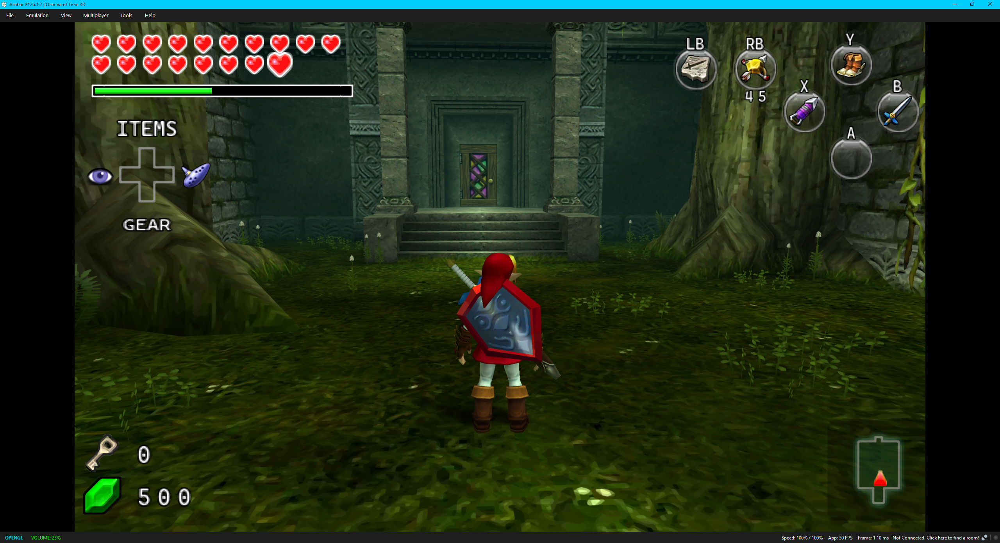
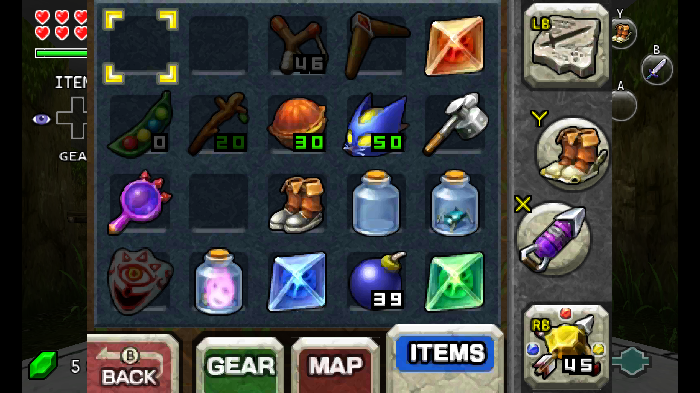
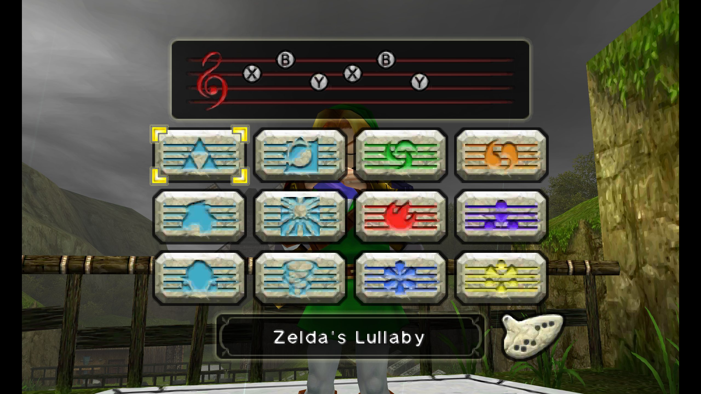

# The One Screen

A single-screen conversion for **The Legend of Zelda: Ocarina of Time 3D**, built for traditional controllers and Azahar.

## Features

- Single-screen-friendly gameplay and menu presentation
- Redesigned HUD for traditional controllers
- Xbox-style button labels and contextual controls
- Proper LB/RB item functionality
- Correct X/Y item-slot behavior
- Reworked Ocarina controls, presentation, and song sheet
- D-pad shortcuts for Items, Gear, Ocarina, and View
- Start opens the Pause menu; Select opens the Map
- Inventory, Gear, Map, File Select, and other interfaces adapted for the new layout
- Context-sensitive screen switching for special game states
- Frontend backdrop fixes and full-width main-screen transition fades
- Numerous HUD and UI fixes designed specifically around single-screen play

Enjoying The One Screen? [Support development with a donation via PayPal](https://www.paypal.com/donate/?hosted_button_id=UCP5YEHAS7HYA).

## Installation

**USA Rev 1 only** | Title ID `0004000000033500` | **Alpha 1.1.12**

[Download ZIP](https://github.com/toadalle/The-One-Screen/archive/refs/heads/main.zip), extract it, and copy `load` into your Azahar user directory. Replace any previous version of this title's mod.

```text
load/mods/0004000000033500/
```

A legally obtained game copy is required. No ROM or retail executable is included. Separate texture packs shown in screenshots are not bundled.

## Controls

### Azahar bindings

| Controller | 3DS binding |
| --- | --- |
| A / B / X / Y | A / B / X / Y respectively |
| LT / RT | L / R |
| LB / RB | ZL / ZR |
| Start / Select | Start / Select |
| D-pad | Corresponding D-pad directions |
| Left stick | Circle Pad |

### Gameplay shortcuts

| Control | Action |
| --- | --- |
| D-pad Up | Items |
| D-pad Down | Gear |
| D-pad Right | Ocarina |
| Hold D-pad Left | View |
| Start | Pause menu |
| Select | Map |

The mod handles item-slot translation internally: Xbox Y uses the native X item lane, and Xbox X uses the native Y item lane.

### Ocarina

| Control | Action |
| --- | --- |
| B | Play the native A note |
| A | Quit |
| RB | Open the song sheet |

The remaining notes use the LT, RT, X, and Y labels shown on screen.

## Screenshots



| Inventory | Ocarina |
| --- | --- |
|  |  |



## Building

Requires Python 3, Zig 0.14.1, `requirements-build.txt`, your own retail inputs matching `config/resource_inputs.json`, and `CascadiaCode-Regular.ttf` in `assets/fonts/`.

```sh
python -m pip install -r requirements-build.txt
python tools/build.py --retail-dir PATH_TO_RETAIL --zig PATH_TO_ZIG --output tos-alpha-1.1.12.zip
```

Developed with AI assistance from ChatGPT and Codex.

## License

[MIT](LICENSE) covers original project code, scripts, tooling, and documentation. Game-derived assets and inherited third-party material are excluded; see [third-party notices](THIRD_PARTY_NOTICES.md).

Unofficial project; not affiliated with or endorsed by Nintendo.
